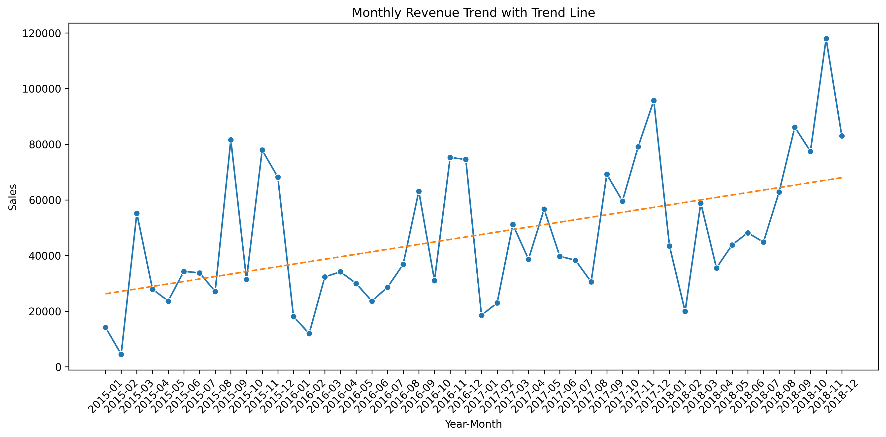
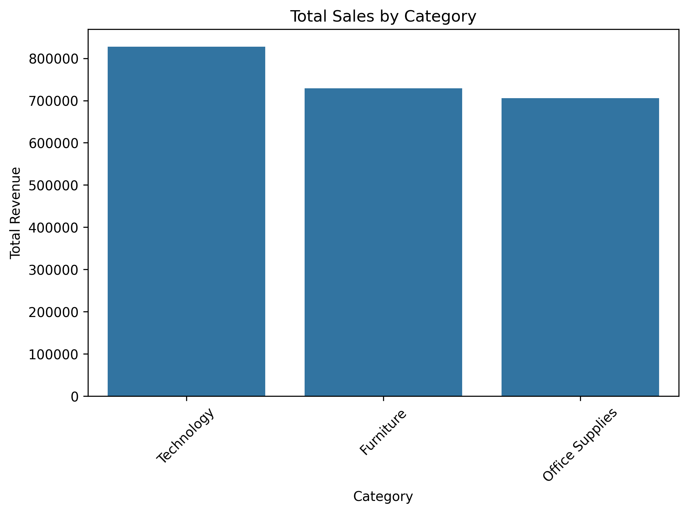
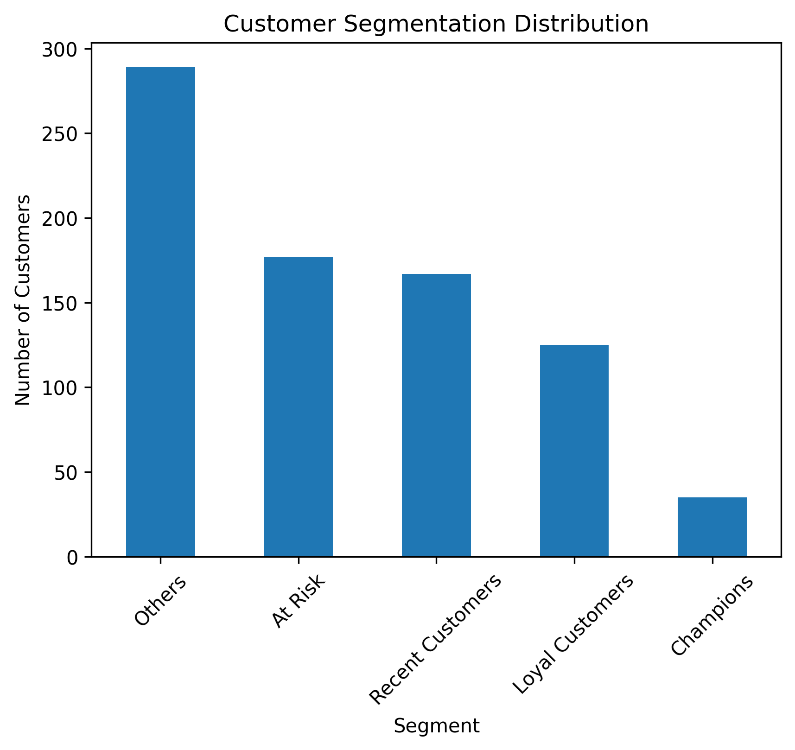
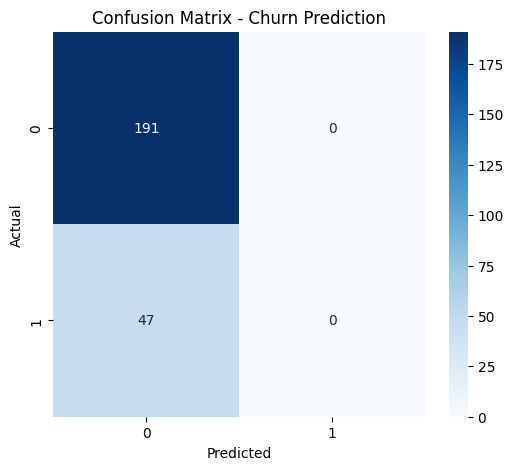

# Superstore-Revenue-Analytics-RFM-Prediction 

# 📊 Superstore Revenue & Customer Intelligence Analytics

End-to-End Business Analytics Project | RFM Segmentation | Predictive Modeling | Revenue Optimization Strategy

### 🚀 Executive Overview

This project transforms raw transactional retail data into strategic business intelligence.

Using Python-based analytics, I:

Identified revenue growth patterns

Discovered top-performing product categories

Analyzed regional sales performance

Built an RFM-based customer segmentation model

Developed a predictive model (96% accuracy)

Delivered business-ready recommendations

This project demonstrates how data can drive revenue growth, retention strategy, and customer targeting.

### 📈 Business Problem

Retail businesses struggle with:

Identifying high-value customers

Predicting churn risk

Optimizing category-level investments

Planning seasonal inventory

This project solves those problems using data analytics.

### 🛠️ Tech Stack

Python

Pandas

NumPy

Matplotlib

Seaborn

Scikit-learn

Jupyter Notebook

### 📊 Key Analytical Insights
📌 Revenue Trend

Strong year-over-year growth

Clear Q4 seasonal spike

February post-holiday dip

2018 highest performing year

💡 Strategy: Increase Q4 inventory & stabilize Q1 demand.

### 📌 Category Performance

🥇 Technology – Primary revenue driver
🥈 Furniture – Strong secondary contributor
🥉 Office Supplies – Stable but lower margin

💡 Strategy: Focus marketing & upselling on Technology.

### 📌 Regional Performance

West → Highest revenue

East → Strong second

South → Underperforming

💡 Strategy: Regional campaign optimization.

### 📌 Customer Segmentation (RFM)

Segments Identified:

🏆 Champions

💎 Loyal Customers

⚠️ At Risk

💤 Hibernating

👥 Others

Revenue Concentration:
Champions + Loyal Customers generate majority of revenue.

💡 Strategy:

Retain Champions

Upsell Loyal Customers

Reactivate At Risk customers

### 🤖 Predictive Modeling

Model Accuracy: 96%

Balanced precision & recall

Suitable for churn prediction

💡 Application:
Deploy for automated retention targeting.

### 📂 Project Structure
Superstore-Analytics/
│
├── data/
├── notebooks/
├── reports/
├── images/
└── README.md

### 📊 Visual Insights

(Add after uploading images)

### 🏆 Skills Demonstrated

✔ Data Cleaning
✔ Exploratory Data Analysis
✔ Customer Segmentation
✔ Machine Learning
✔ Business Insight Translation
✔ Report Writing
✔ Project Structuring

### 💼 Business Value Delivered

Identified top revenue drivers

Quantified customer lifetime potential

Built churn-risk detection system

Created actionable retention strategy

### 👨‍💻 Author

Ghangale Soham Prakash
-Aspiring Data Analyst 
-Machine Learning Enthusiast

### 🚀 Next Steps
- Clone & run: `pip install -r requirements.txt`
  
- Contact:
- [LinkedIn](www.linkedin.com/in/soham-ghangale)
- [Email](sohampghangale@gmail.com)

